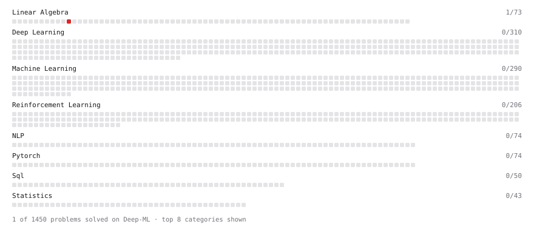

# Deep-ML

My machine learning practice from [Deep-ML](https://www.deep-ml.com). Every solution here was written by hand.

**2** solved · 1 problems · 1 labs · 0 math

[**Browse the interactive portfolio**](https://Utkarshmishra2k2.github.io/deep-ml/) to replay this filling in over time.

## Problems

| | Difficulty | Solved | |
| --- | --- | --- | --- |
| [Singular Value Decomposition (SVD) of 2x2 Matrix](https://www.deep-ml.com/problems/12) | hard | 2026-09-24 | [solution](problems/0012-singular-value-decomposition-svd-of-2x2-matrix) |

## Labs

| | Difficulty | Solved | |
| --- | --- | --- | --- |
| [PyTorch: Build a Complete Training Loop](https://www.deep-ml.com/labs/13) | easy | 2026-09-24 | [solution](labs/0013-pytorch-build-a-complete-training-loop) |

---

_This file is regenerated by Deep-ML on every push._
