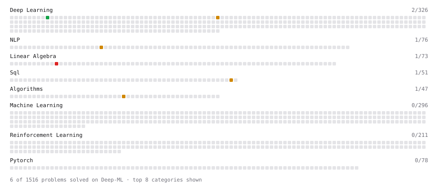

# Deep-ML

My machine learning practice from [Deep-ML](https://www.deep-ml.com). Every solution here was written by hand.

**9** solved · 6 problems · 3 labs · 0 math

[**Browse the interactive portfolio**](https://Utkarshmishra2k2.github.io/deep-ml/) to replay this filling in over time.

## Problems

| | Difficulty | Solved | |
| --- | --- | --- | --- |
| [Implement ReLU Activation Function](https://www.deep-ml.com/problems/42) | easy | 2026-10-06 | [solution](problems/0042-implement-relu-activation-function) |
| [Dropout Layer](https://www.deep-ml.com/problems/151) | medium | 2026-09-28 | [solution](problems/0151-dropout-layer) |
| [Merge Intervals and Interval List Intersections](https://www.deep-ml.com/problems/1167) | medium | 2026-10-06 | [solution](problems/1167-merge-intervals-and-interval-list-intersections) |
| [Multi-Token Prediction Training Objective](https://www.deep-ml.com/problems/745) | medium | 2026-09-28 | [solution](problems/0745-multi-token-prediction-training-objective) |
| [Power Users With Purchases in Every Month of the Year](https://www.deep-ml.com/problems/1462) | medium | 2026-10-06 | [solution](problems/1462-power-users-with-purchases-in-every-month-of-the-year) |
| [Singular Value Decomposition (SVD) of 2x2 Matrix](https://www.deep-ml.com/problems/12) | hard | 2026-09-24 | [solution](problems/0012-singular-value-decomposition-svd-of-2x2-matrix) |

## Labs

| | Difficulty | Solved | |
| --- | --- | --- | --- |
| [PyTorch: Build a Complete Training Loop](https://www.deep-ml.com/labs/13) | easy | 2026-09-24 | [solution](labs/0013-pytorch-build-a-complete-training-loop) |
| [Train a Linear Regression Model](https://www.deep-ml.com/labs/18) | easy | 2026-09-28 | [solution](labs/0018-train-a-linear-regression-model) |
| [MNIST: Adversarial Example Generation](https://www.deep-ml.com/labs/5) | hard | 2026-09-29 | [solution](labs/0005-mnist-adversarial-example-generation) |

---

_This file is regenerated by Deep-ML on every push._
